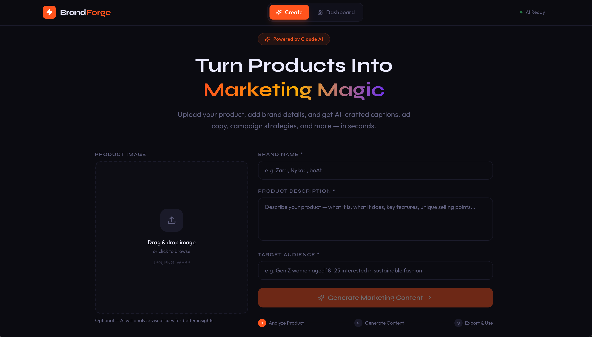
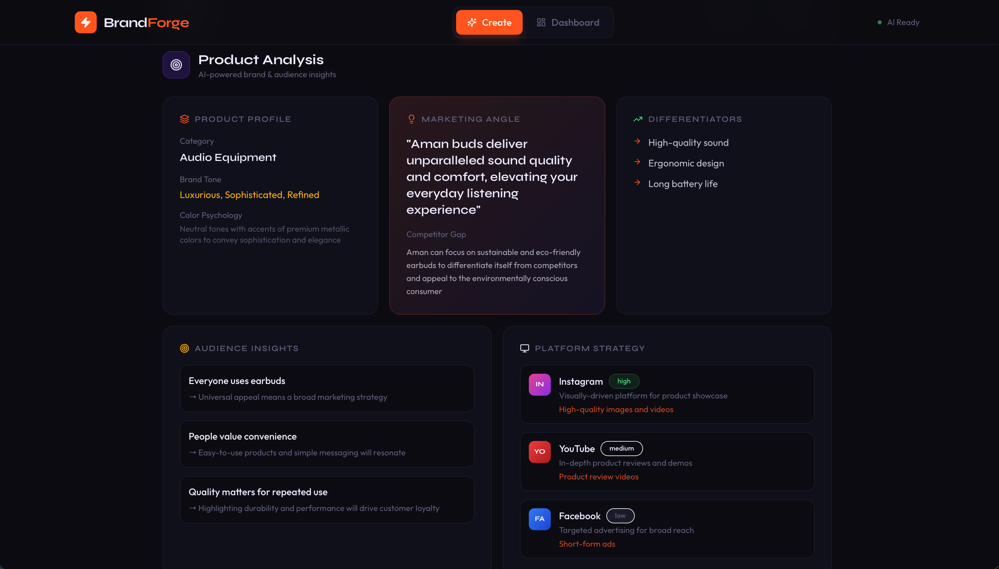
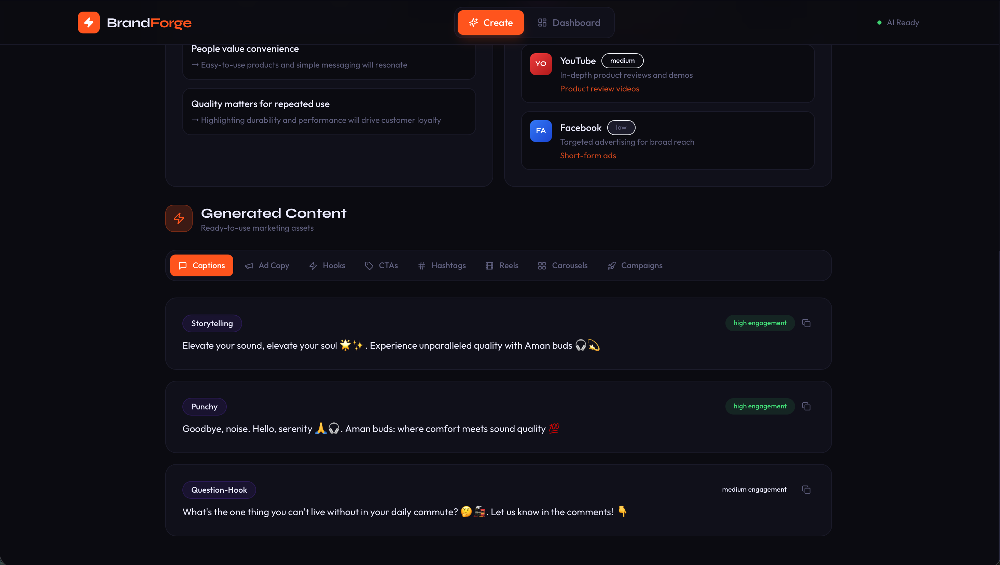
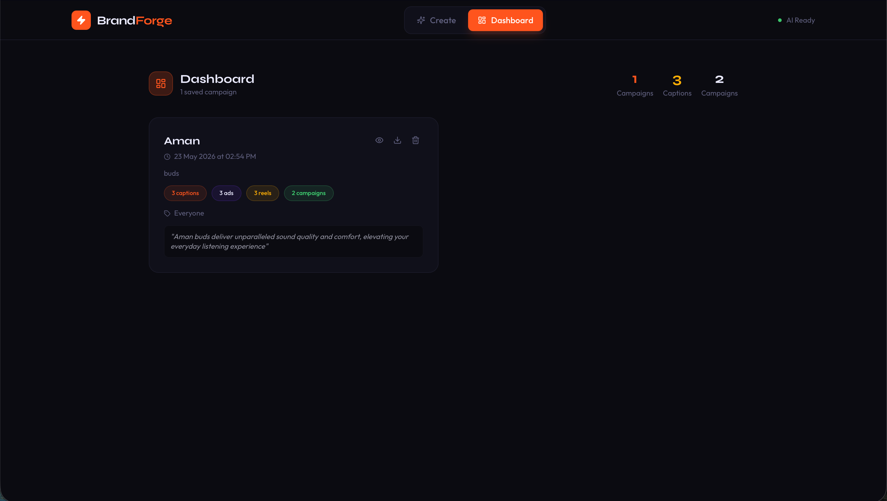

# BrandForge — AI Marketing Agent

> Turn product images and brand details into complete, ready-to-use marketing content — powered by Groq LPU inference and Llama 3.3 70B.


---

## 🌐 Live Demo

Frontend:  
https://ai-marketing-agent-sigma.vercel.app

Backend:  
https://ai-marketing-agent-bf25.onrender.com

GitHub Repository:  
https://github.com/amankataria100/ai-marketing-agent

---

## ✨ Features

| Feature | Description |
|---|---|
| 🖼️ **Product Upload** | Drag-and-drop image upload with brand details form |
| 🧠 **AI Product Analysis** | Brand tone, audience insights, platform strategy, competitor gap analysis |
| ✍️ **Content Generator** | Instagram captions (3 styles), ad copy (3 platforms), hooks, CTAs |
| #️⃣ **Hashtag Sets** | Branded, niche, and trending hashtag bundles |
| 🎬 **Reel Ideas** | AI-generated reel concepts with hooks and duration |
| 🃏 **Carousel Ideas** | Slide-by-slide carousel scripts with objectives |
| 🚀 **Campaign Strategies** | Full campaign concepts with content pillars |
| 💾 **Dashboard** | Save, view, export (JSON), and delete past outputs |
| 📋 **Clipboard Copy** | One-click copy for all generated outputs |
| 🌙 **Editorial UI** | Dark premium UI with animations and microinteractions |

---

## 🏗️ Tech Stack

| Layer | Technology |
|---|---|
| **Frontend** | React 18 + Vite + Tailwind CSS + Framer Motion |
| **Backend** | FastAPI (Python) + Uvicorn |
| **AI** | Groq API + Llama 3.3 70B Versatile |
| **HTTP Client** | Axios |
| **File Handling** | python-multipart |
| **Persistence** | localStorage |
| **Deployment** | Vercel + Render |

---

## 🤖 AI Workflow

```text
User Input
    │
    ▼
┌─────────────────────────────────────┐
│  STEP 1: Product Analysis           │
│  • Image + brand details            │
│  • Groq + Llama 3.3 70B             │
│  • Returns structured insights      │
│    - product_category               │
│    - brand_tone                     │
│    - audience_insights              │
│    - competitor_gap                 │
│    - marketing_angle                │
└─────────────────────────────────────┘
    │
    ▼
┌─────────────────────────────────────┐
│  STEP 2: Content Generation         │
│  • Context-grounded generation      │
│  • Analysis + inputs → AI           │
│  • Returns:                         │
│    - captions                       │
│    - ad copy                        │
│    - hooks                          │
│    - CTA suggestions                │
│    - hashtags                       │
│    - reel ideas                     │
│    - carousel ideas                 │
│    - campaign suggestions           │
└─────────────────────────────────────┘
    │
    ▼
Dashboard (localStorage persistence)
```

### Key AI Design Decisions

- **Two-step pipeline** for grounded generation
- **Structured JSON schemas** for reliable parsing
- **Context chaining** between analysis and generation
- **Vision-aware prompting** for image-enhanced outputs
- **Competitor gap analysis** and positioning insights
- **Marketing-focused prompting** optimized for engagement

---

## ⚡ Engineering Highlights

- FastAPI backend with robust error handling
- Strict JSON cleanup + parsing pipeline
- Modular React component architecture
- localStorage persistence for saved outputs
- Animated loading states with Framer Motion
- Responsive editorial dark UI
- Production deployment with Vercel + Render
- REST API integration using Axios
- Clean separation of frontend/backend concerns

---

## 🚀 Setup

### Prerequisites

- Node.js 18+
- Python 3.10+
- Groq API key

---

### 1. Clone Repository

```bash
git clone https://github.com/amankataria100/ai-marketing-agent.git
cd ai-marketing-agent
```

---

### 2. Backend Setup

```bash
cd backend

python -m venv venv

source venv/bin/activate
# Windows:
# venv\Scripts\activate

pip install -r requirements.txt
```

Create `.env`

```env
GROQ_API_KEY=your_api_key_here
MODEL_NAME=llama-3.3-70b-versatile
```

Run backend:

```bash
uvicorn main:app --reload --port 8000
```

Backend runs at:

```text
http://localhost:8000
```

Swagger docs:

```text
http://localhost:8000/docs
```

---

### 3. Frontend Setup

```bash
cd frontend

npm install

npm run dev
```

Frontend runs at:

```text
http://localhost:5173
```

---

## 📁 Project Structure

```text
ai-marketing-agent/
├── README.md
├── backend/
│   ├── main.py
│   ├── requirements.txt
│   └── .env.example
└── frontend/
    ├── src/
    │   ├── App.jsx
    │   ├── components/
    │   │   ├── Navbar.jsx
    │   │   ├── UploadSection.jsx
    │   │   ├── AnalysisCard.jsx
    │   │   ├── ContentTabs.jsx
    │   │   ├── Dashboard.jsx
    │   │   └── LoadingState.jsx
    │   └── utils/
    │       └── api.js
    ├── package.json
    ├── tailwind.config.js
    └── vite.config.js
```

---

## 🔌 API Reference

### POST `/api/analyze`

Analyzes product image + brand details and returns structured marketing insights.

### POST `/api/generate`

Generates:
- Captions
- Ad copy
- Hooks
- CTAs
- Hashtags
- Reel ideas
- Carousel ideas
- Campaign suggestions

---

## 📸 Screenshots

### Homepage / Upload Section



---

### AI Analysis Output



---

### Content Generation Tabs



---

### Dashboard & Saved Outputs

  

---

## 🗺️ Future Improvements

- [ ] Video understanding support
- [ ] Multi-language content generation
- [ ] AI-powered A/B testing
- [ ] Social media scheduler integration
- [ ] PDF/DOCX export
- [ ] Brand memory system
- [ ] Real-time streaming responses
- [ ] Team collaboration dashboard

---

## 🛠️ AI Model Configuration

In `backend/main.py`:

```python
MODEL = "llama-3.3-70b-versatile"
```

Models can easily be swapped using Groq-supported inference APIs.

---

## 👨‍💻 Author

Aman Kataria

- GitHub: https://github.com/amankataria100
- LinkedIn: https://www.linkedin.com/in/aman-kataria-7a8405257/

---
